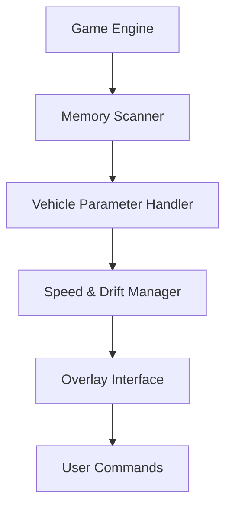

# Backseat Drivers Trainer 🚗

The **Backseat Drivers Trainer** is a full-featured enhancement utility built to fine-tune player control, race timing, and cooperative efficiency. Perfect for both casual players and competitive drivers, this trainer delivers precision command over vehicle behavior, cooldowns, and performance values — helping you stay in control even when the road turns wild.

It’s an intuitive, safe, and highly customizable tool designed to bring the best out of every race and mission inside *Backseat Drivers*.

---

## 🧭 Overview

The trainer runs externally, using smart process mapping to safely apply boosts, control modifiers, and visual indicators without interfering with core gameplay files. Every feature can be toggled live through an in-game overlay — meaning you can focus on driving, teamwork, and precision handling without unnecessary menu navigation.

[!IMPORTANT]

> Backseat Drivers Trainer uses non-destructive read/write methods. It never alters permanent saves or system memory blocks.

---

## ⚙️ Key Features

* **🚀 Speed Multiplier:** Adjust acceleration and top speed in real time.
* **🧠 Focus Mode:** Slows down game time to improve reaction accuracy.
* **🔥 Instant Cooldowns:** Reset special ability timers instantly.
* **🛞 Drift Stabilizer:** Prevents spinouts during sharp cornering or team boosts.
* **💡 HUD Enhancer:** Adds live speed, drift angle, and teammate proximity display.
* **🎮 Configurable Hotkeys:** Rebind all toggles and sliders through `.ini` or in-game UI.

Example Config:

```ini
[TRAINER_SETTINGS]
SpeedMultiplier=1.8
FocusMode=True
CooldownReset=True
DriftAssist=True
HUD=True
```

[!NOTE]

> Settings can be edited mid-race using the overlay or by pressing `CTRL + SHIFT + S` to save instantly.

---

## 🧰 Setup & Usage

1. **Download** the latest verified trainer build.
2. **Extract** it into your *Backseat Drivers* root directory.
3. **Run** `BackseatDriversTrainer.exe` as Administrator.
4. **Start the game**, and press `F1` to activate the overlay.
5. **Use arrow keys or mouse scroll** to navigate options.

Command Example:

```bash
BackseatDriversTrainer.exe /profile="RallyPro.cfg" /overlay
```

[!WARNING]

> Run the trainer before starting the game for full feature initialization.

---

## 💻 Compatibility

| Platform           | Status | Notes                            |
| ------------------ | ------ | -------------------------------- |
| Windows 10/11      | ✅      | 64-bit optimized build           |
| Steam Version      | ✅      | Fully supported                  |
| Epic Games Version | ✅      | Manual attach mode available     |
| Controller Support | ✅      | Overlay accessible via D-Pad     |
| Offline Mode       | ✅      | Works without network dependency |

Accessibility: Built-in high-contrast mode, font scaling, and voice notification toggle.

---

## 🧩 Feature Flow



---

## 🧠 Advanced Configurations

**Rally Mode (Precision Focus)**

```ini
[PRESET_RALLY]
SpeedMultiplier=1.3
FocusMode=True
CooldownReset=False
DriftAssist=True
HUD=True
```

**Chaos Mode (High Risk/Reward)**

```ini
[PRESET_CHAOS]
SpeedMultiplier=2.5
FocusMode=False
CooldownReset=True
DriftAssist=False
HUD=False
```

**Co-Op Boost Mode (Team Racing)**

```ini
[PRESET_TEAM]
SpeedMultiplier=1.6
FocusMode=True
CooldownReset=True
DriftAssist=True
HUD=True
```

Switch instantly between profiles with `F2`, `F3`, and `F4`.

---

## 💬 FAQ

**Q: Does the trainer work with all versions?**
A: Yes — it auto-detects both standard and deluxe editions.

**Q: Can it damage save files?**
A: No. All value changes are temporary and revert when closed.

**Q: Is there a frame rate impact?**
A: Minimal — the overlay is GPU-light, using <2% resources.

**Q: Can I use it offline?**
A: Absolutely. The trainer runs completely offline.

**Q: Are updates automatic?**
A: The trainer checks for new offset patches and notifies you in the console.

---

## 🚀 Feature Roadmap

| Version | Feature                   | Status     |
| ------- | ------------------------- | ---------- |
| v1.5    | AI Teammate Boost Control | ✅ Released |
| v1.6    | Voice Command Mode        | 🚧 Testing |
| v1.7    | Adaptive Drift Assist     | 🧩 Planned |

---

## 🏁 Final Thoughts

The **Backseat Drivers Trainer** is more than a tool — it’s your co-pilot in mastering precision, rhythm, and control. With real-time stat tweaks, customizable overlays, and smart driving assists, it turns every chaotic race into a controlled masterpiece.

Perfect for both competitive racers and casual co-op adventurers, it’s built to keep you in the driver’s seat — literally and figuratively.

---
